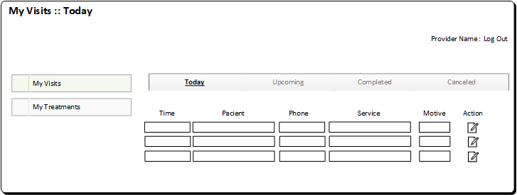

# Screen Design

## Screen for Customers (aka Patients)
### Customer Sign Up

### Customer Log In

### Customer Account : Personal Info

### Customer Account : Insurance Info

### Customer Account : Pharmacies List

### Customer Account : Payment Info

### Customer Account : Upcoming Visits

### Customer Account : Completed Visits

### Customer Account : Treatments

### Customer Account : Treatment Follow Up

## Screen for Doctors and Physicians (aka Providers)

### Provider Log In

### Provider Account : Visit Manager

### Provider Account : Today Visits

### Provider Account : Treatments

### Provider Account : Treatment Follow Up

